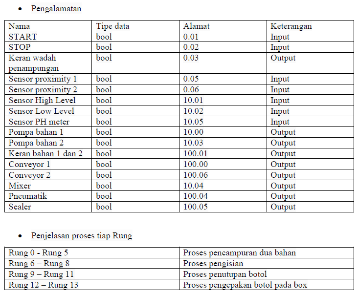
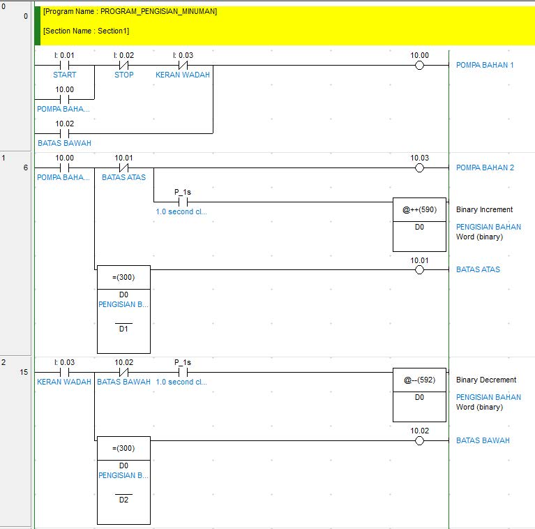
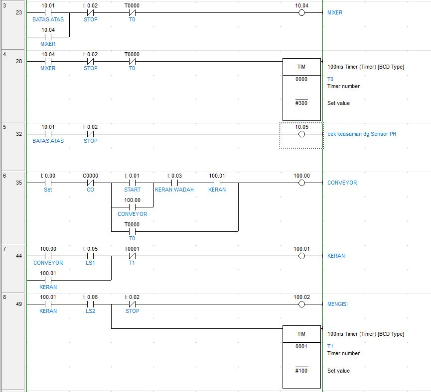
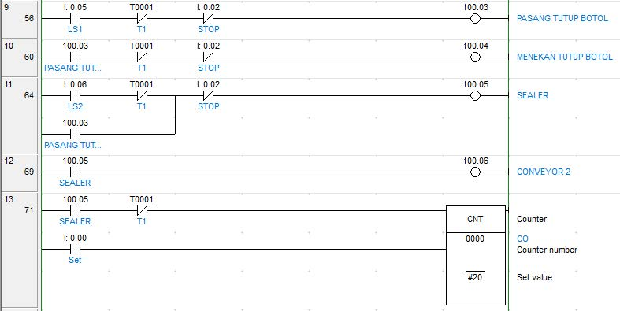

# PLC-Omron-Filling-of-bottles-Automation
PLC Omron Explanation About Filling of bottles Automation by CX-Programmer on CX-One
How to program PLC with CX-Programmer 

## Background 

The goal of the PLC Omron Filling of Bottles Automation project is to automate the process of filling bottles with a specific volume of liquid using Programmable Logic Controller (PLC) technology from Omron. The automation of this process is intended to improve the efficiency and accuracy of the filling process while reducing the amount of manual labor required.

In traditional manual bottle filling operations, the process is time-consuming, prone to human error, and often results in inconsistencies in the fill volumes of the bottles. The use of a PLC-based system will help to standardize the fill volumes of each bottle, reduce the risk of human error, and increase the overall efficiency of the operation.

The PLC will be programmed to control the flow of the liquid into the bottles, monitor the fill level, and stop the flow of liquid once the desired fill volume has been reached. The system will also include sensors to detect any malfunctions or issues during the filling process, such as bottle jams or low liquid levels, and take appropriate action to correct the issue.

## Project

Sensors used Sensors: Proximity 1, Proximity 2, High level, Low Level

PH meter Actuators: Material pump 1, Material pump 2, Container faucet, Conveyor 1, Conveyor 2, Mixer

Video: [Explanation about project PLC](https://youtu.be/a6hl7-lfZ4Q) 

## Details
- Addressing Table

## Ladder Diagram

## Another PLC Project
[PLC Omron Automatic Sump System](https://github.com/electricianinsomniac/PLC-Omron-Automatic-Sump-System)
